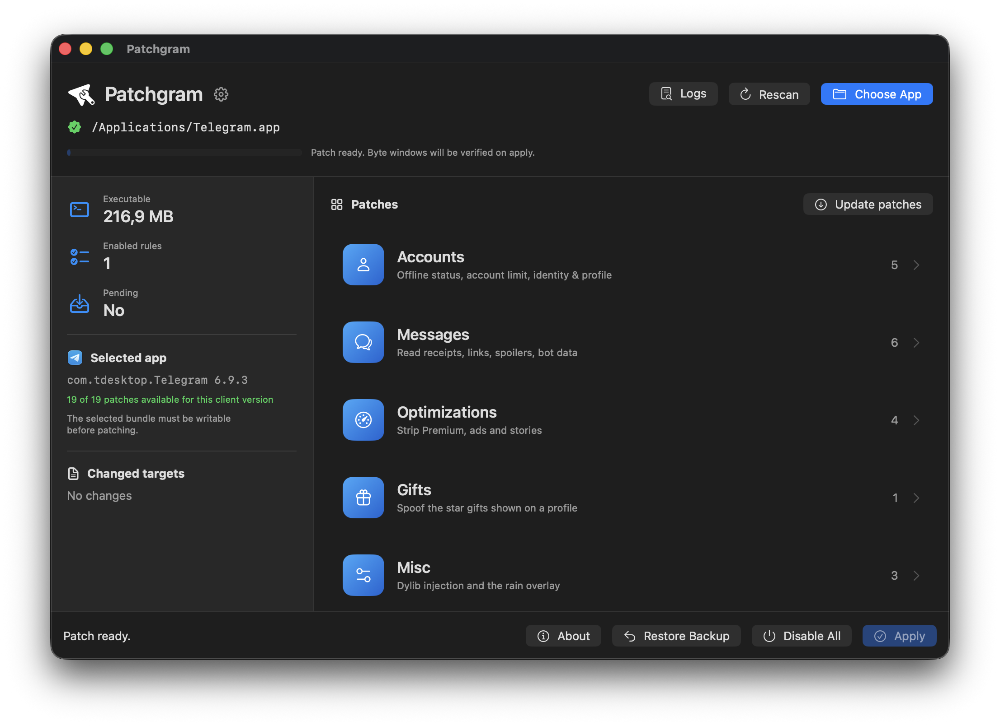

# Patchgram



Required: ARM MacOS 12.0+ (Apple Silicon devices), [Telegram Desktop 6.9.3](https://telegram.org/dl/desktop/mac)

Patch list: [RU](patchlist_ru.md) / [EN](patchlist.md)

Enter this command in terminal to fix "The application "Patchgram" can't be opened":
```sh
xattr -dr com.apple.quarantine /Applications/Patchgram.app
```
